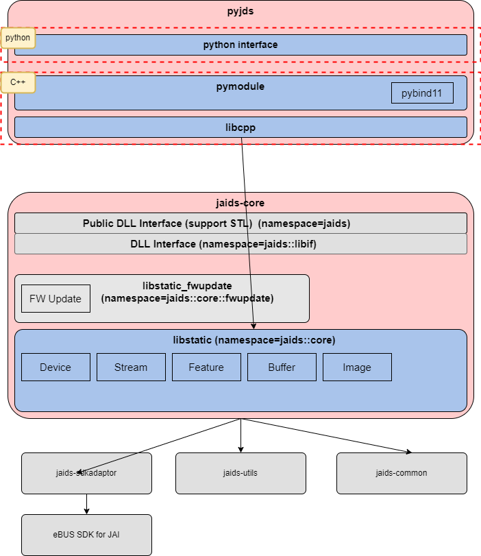

# 設計資料 | Design Documentation

pyjdsはiaids-coreのPythonバインディングでありpythonで実装されたインタフェースレイヤーとC++で実装された`pymodule`,`libcpp`から構成される。python interfaceはpythonで実装されたpublic interfaceでありユーザはpython interfaceのクラスを利用してアプリの実装を行う。`pymodule`はC++のコードを[pybind11](https://github.com/pybind/pybind11)を利用してbindingするモジュールであり`*.pyd`形式のファイルとしてリリースされる。pydという拡張子であるが実態はDLLファイルと同一である。

pyjds is a Python binding of iaids-core, consisting of an interface layer implemented in python as well as `pymodule`,`libcpp` implemented in C++. Python interface is a public interface implemented in python. Users can implement applications by using classes of the python interface. The `pymodule` is a module for binding C++ code using [pybind11](https://github.com/pybind/pybind11) and is released as a `*.pyd` format file. Although it has the extension `pyd`, it is actually the same as a DLL file.




## folder構成 | Folder Structure

```
    Directory: C:\work\10.development\pyJds

Mode                 LastWriteTime         Length Name
----                 -------------         ------ ----
d----          2022/01/21    10:38                .github
d----          2022/01/06     9:38                .vs
d----          2022/05/17    10:51                docs
d----          2022/02/14    20:20                python
d----          2022/05/17    10:45                src
d----          2022/03/07    14:28                test
```

| folder |                                         |
| ------ | --------------------------------------- |
| docs   | 設計ドキュメントを格納 <br> Store Design Documentation |
| python | public interface                        |
| src    | c++ source code                         |
| test   | google testを利用したc++実装のtest code <br> test code for c++ implementation using google test |

### python folder

```
Mode                 LastWriteTime         Length Name
----                 -------------         ------ ----
d----          2022/01/26    11:03                .pytest_cache
d----          2022/03/07    16:30                api-docs
d----          2022/05/17    10:48                src
d----          2022/05/01    16:13                test
d----          2022/03/02    15:35                tools
```

| folder   |                                                             |
| -------- | ----------------------------------------------------------- |
| api-docs | 公開Intaerface document生成用ファイル、詳細は別途記載  <br> File for generating public Interface document, details to be provided separately    |
| src      | public interface                                            |
| test     | pytestを利用したtest code, GS/PM向けSample codeを兼ねている <br>  Test code using pytest, also serves as Sample code for GS/PM|
| tools    | Debug用途のUtility,リリースはしない  <br>  Utility for Debug use, will not release  |

### src folder

src folderはC++の実装をpython bindingするコード群でありpyjdsのコアとなるモジュールである。`libcpp`にはpython bindingの機能は実装していない。binding用の`pymodule`から利用されるstatic libraryである。`libcpp`,`pymodule`と実装を分ける事でDebugをやりやすくする事が目的である。bindingには`pybind11`を利用しているが`pybind11`をlinkするとGoogle TestでTestが実行できなかった。その対応としてモジュールを分割している。

The src folder is the core module of pyjds, which is a set of codes for python binding of C++ implementations. The `libcpp` does not implement python binding. It is a static library used by `pymodule` for binding. The purpose of `libcpp` and `pymodule` is to make debugging easier by separating the implementation from `libcpp` and `pymodule`. The `pybind11` is used for `binding`, but when `pybind11` is linked, the test could not be executed by Google Test. To solve this problem, the module was split.

```
Mode                 LastWriteTime         Length Name
----                 -------------         ------ ----
d----          2022/05/17    10:45                libcpp
d----          2022/05/17    10:45                pymodule
```

## How to build

srcフォルダ以下のC++モジュールについてはbuildが必要であり、build成功すると*.pyd形式のfileが生成される。buildはCMakeを利用して行う。jaids-coreなど依存しているlibraryもbuild時にダウンロード、Link設定を自動で行う。

:exclamation:linkに必要な依存モジュールはhttps://github.com/jai-rd/pyJds/blob/develop/src/CMakeLists.txtに記述している。現状社内評価中であり全てdevelop branchを利用しているが、リリース時にはTAGを使って依存モジュールのfixが必要。

具体的なbuild手順は[こちら](./create_whl.md)を参照

Build C++ modules under the src folder, and a *.pyd file will be generated if the build is successful. The Build is done using CMake. The jaids-core and other dependent libraries are also downloaded at build time and the link settings are done automatically. 

:exclamation:Dependent modules required for the link are described in https://github.com/jai-rd/pyJds/blob/develop/src/CMakeLists.txt. Currently, we are using the develop branch for all of the modules, but at the time of release, we will need to use TAG to fix the dependent modules.

For specific build procedures, please refer [here](./create_whl.md). 

### pymodule

基本的にはpythonからAPI実行された場合pymoduleは対応するjaids-coreのメソッドを実行するという流れであり、一部例外を除きpymoduleで特別な事は行っていない。一部例外とはRAW画像の取得が該当する。

pythonでは画像データはnumpyのndarrayを利用する事が一般的であり、pyjdsでもRAW画像はndarray形式である。カメラから取得したRAW画像をndarrayに変換する処理をpymoduleで実装している。

When API is executed from python, the pymodule executes the corresponding jaids-core method, the pymodule does nothing special with some exceptions (acquisition of RAW images).

In python, it is common to use numpy's ndarray for image data, and in pyjds, RAW images are also in ndarray format. The process of converting RAW images acquired from the camera to ndarray is implemented in pymodule.

https://github.com/jai-rd/pyJds/blob/eac394703be2220c0782c04d2fa70323f2f2b188/src/pymodule/module.cpp#L72-L94

### 要求仕様 | Required Specifications

PM, GS作成の下記Software Requirement Specificationのうち、Prioryty=0の物を基本的に対応している

Supports the P=0 requirements described in the following Software Specification Requirements created by PM and GS.

https://jaionline.sharepoint.com/:w:/s/JAIDeveloperSuiteVer2/EQEOHLB2GO9HjY4R5i-mqOMBIy25MsVkTe8zjtulpADyrA?e=eRhO0y

実装状況詳細は[additional_explanation_of_SRS_support_status.md](additional_explanation_of_SRS_support_status.md)に記載

Actual implmentation status is descibed here: [additional_explanation_of_SRS_support_status.md](additional_explanation_of_SRS_support_status.md)

### support python

当初要求仕様ではPython3.7対応があったがPython3.7はEOLが近いので未対応とした。[Python EOL](https://github.com/jai-rd/pyJds/issues/1)

The original specification requirements included support for Python 3.7, but Python 3.7 is close to EOL, so it was decided not to support it.Python EOL

## Release

pyjdsのリリースはinterfaceであるPythonコードおよびpydファイルをパッケージしたwhlファイルのリリースを行う。詳細は[whlファイルの作成](create_whl.md)を参照の事

At the pyjds release, release a whl file that packages the Python codes that are interface and pyd files. See Create whl file for details. [whlファイルの作成](create_whl.md)

### Testコード | Test Code

`python/test`以下にpytestを利用したtestコードが存在する。これは社内GS向けのSampleCodeとして利用していると共に、リリース時に動作確認用に利用している。pipのdevelopモードを利用する事でwhlファイルをインストールせずに実行可能となる。[developモードでDebugする方法](debug_py.md)

There is a test code using pytest under python/test. The code is used as SampleCode for GS and for checking the operation at the time of release. By using pip's develop mode, you can run the code without installing the whl file. [How to Debug in Develop Mode](debug_py.md)


## APIドキュメント作成 | Generate API Documentation

ユーザ向けのAPIドキュメントはSphinxを使って生成する。[作成手順](sphinx.md)

The API documentation for users is generated using Sphinx. [How to Generate](sphinx.md)

